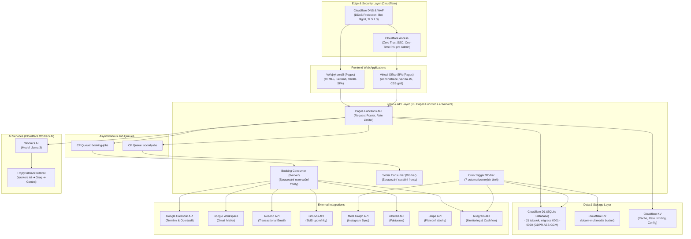

# 🌿 Bicom Písek — Virtual Office & produkční web

Verze: **v1.0 RC — aktivní finalizace před předáním**

Hlavní produkční repozitář organizace **BiCOM-PiSEK** (`bicom-pisek-produkcni-repozit`). Tento repozitář představuje autoritativní zdroj pravdy (Single Source of Truth) pro celé technologické a programové řešení lokálního centra. Projekt je navržen a realizován podle standardu **MEVERIK STUDIO** s využitím moderní architektury **Edge-First** – veškerá aplikační logika, databáze i umělá inteligence běží na okraji sítě (Edge), což zajišťuje bleskovou odezvu (typicky < 200 ms), vysokou spolehlivost a nulové fixní provozní náklady za pronájem klasických serverů.

**Provozovatel:** BIO ONE LIFE s.r.o. (klient)  
**Dodavatel:** WHC s.r.o. / MEVERIK STUDIO

> ⚠️ **Právní vymezení:** Biorezonanční metoda BICOM Optima je komplementární (doplňková) metoda. Nenahrazuje standardní lékařskou péči, diagnostiku ani klinickou léčbu. Provozovatel neposkytuje zdravotní služby ve smyslu zákona č. 372/2011 Sb., o zdravotních službách. Všechny prezentované texty a výstupy AI nástrojů jsou důsledně podrobeny tomuto tónu.

**Kanonická doména:** [bicom-pisek.cz](https://bicom-pisek.cz)

> 📊 **Aktuální stav projektu (hloubkový audit 21. 6. 2026):** [docs/DEEP_RESEARCH_2026-06-21.md](docs/DEEP_RESEARCH_2026-06-21.md) — živá introspekce produkce (D1/KV/R2/Workers) + analýza repa. Kompas: [docs/ROADMAP.md](docs/ROADMAP.md).

---

## 🏗️ Celková architektura ekosystému

Projekt je kompletně integrován v rámci globální infrastruktury Cloudflare. Následující diagram znázorňuje tok požadavků od uživatele, přes bezpečnostní filtry, aplikační vrstvu na Edge, až po asynchronní zpracování na pozadí a externí integrace.



---

## 🛠️ Technologický Stack

Architektura je postavena na principu **Edge-First, Cloudflare-native**. Produkční repozitář představuje optimalizovanou a stabilní předatelnou výseč širší platformy MEVERIK STUDIO, přičemž je plně zachován zero-cost provozní model a maximální bezpečnost.

| Vrstva | Technologie | Funkce v systému |
| :--- | :--- | :--- |
| **Edge Runtime & DNS** | Cloudflare DNS, WAF | Ochrana sítě, TLS 1.3 certifikace, WAF pravidla, rate-limiting a bot management. |
| **Frontend** | HTML5, CSS3 (Vanilla CSS + Tailwind), Vanilla ES6 JS | Rychlý static web (Pages) bez zbytečného JS overheadu, responzivní layouty, plynulé přechody (View Transitions API). |
| **Backend & Logika** | Cloudflare Pages Functions, Cloudflare Workers | Serverless API endpointy, zprostředkování datových toků, zpracování událostí v reálném čase. |
| **Relační databáze** | Cloudflare D1 (SQLite na okraji sítě) | Transakční databáze (14 tabulek) s CHECK constrainty, cizími klíči a indexy. |
| **Stavová Cache & Limiter** | Cloudflare KV | Rychlá distribuovaná cache, koordinace rate-limiteru a ukládání konfiguračních stavů. |
| **Blob Storage** | Cloudflare R2 | Bezúdržbový bucket pro obrázky a média (nulový egress poplatek). |
| **Asynchronní fronty** | Cloudflare Queues | Zpracování úloh na pozadí (booking consumer, social consumer) odolné vůči výpadkům třetích stran. |
| **Umělá inteligence** | Cloudflare Workers AI, Groq, Gemini API | Integrace lokálního modelu Llama 3 s fallback řetězcem přes Groq na Gemini API. |
| **Administrativní Auth** | Cloudflare Access (Zero Trust) | Zabezpečení administrativní zóny Virtual Office, One-Time PIN přihlašování přes registrované e-maily. |

---

## 🌟 Klíčové Funkce

- **Moderní asynchronní rezervace:** Uživatel odešle poptávku termínu přes interaktivního průvodce. API okamžitě zašifruje data, uloží požadavek do D1 a zařadí jej do asynchronní fronty (`booking-jobs`). Booking Consumer následně na pozadí zapíše událost do Google kalendáře, vygeneruje a odešle e-mail přes Resend a SMS upomínku přes GoSMS.
- **GDPR Security & Field-level šifrování:** Osobní údaje (jméno, e-mail, telefon, poznámka) jsou před zápisem do DB šifrovány pomocí standardu AES-GCM (256-bit, Web Crypto API) dle článku 9 GDPR. Dešifrovací klíč žije v bezpečném prostředí a data se dešifrují až na klientu v administraci.
- **Automatická anonymizace (GDPR cron):** Cron worker denně vyhledává a anonymizuje data rezervací starší než 30 dní (nahrazení citlivých polí prázdným řetězcem `''`), čímž splňuje legislativní minimalizaci dat. Ukládá se pouze auditní log o provedené akci.
- **AI Copywriter s právním guardrailem:** Generátor textů v admin SPA ("Quiet Luxury" tón) s modulární právní bariérou (rules-health) a 4 úrovněmi přísnosti (`off`, `mild`, `optimal`, `strict`) řízenými z nastavení. Zabraňuje generování nepovolených medicínských tvrzení (červená a oranžová zóna rizikových frází) a navrhuje bezpečná synonyma.
- **AI Rádce (Chatbot):** Veřejný chatovací widget napojený na Workers AI, poskytující odpovědi na dotazy s dynamickým právním filtrem a trojitým fallbackem.
- **Bezúdržbový blog / Instagram Sync:** Cron worker stahuje příspěvky z Instagramu a ukládá je do R2, čímž automaticky plní sekci Magazínu na webu bez nutnosti ručního psaní článků.
- **GEO-Marketing & Analytics:** Sběr a vyhodnocování geografických dat (leadů) na základě PSČ a měst pro doporučování a optimalizaci regionálních kampaní.
- **Virtual Office SPA:** Kompletní administrativní konzole (Dashboard s KPI a trendy, Kalendář, Blog a AI nástroje, Fakturace, GEO přehledy, Nastavení).

---

## 🔗 Registr API a Endpointů

### Veřejné API (`/api/*`)
- `GET /api/services` — Načtení katalogu programů z D1 s fallbackem na KV cache.
- `POST /api/book` — Zpracování poptávky termínu, šifrování osobních dat a zápis do fronty.
- `GET /api/booking-config` — Veřejné načtení toggle stavů nastavení (např. nutnost Stripe platby).
- `POST /api/newsletter` — Přihlášení k newsletteru s kontrolou duplicity a šifrováním.
- `POST /api/chat` — AI Rádce na webu s napojením na databázový kontext FAQ a služeb.
- `GET /api/blog` — Výpis blogových příspěvků a IG sync článků pro veřejný Magazín.
- `GET/POST /api/calendar-hook` — Webhook pro synchronizaci změn z Google kalendáře zpět do D1.
- `POST /api/stripe-checkout` — Inicializace platby zálohy na Stripe.
- `POST /api/stripe-webhook` — Zpracování potvrzení platby a dokončení rezervace.
- `GET /api/health` — Diagnostika zdraví databáze, cache, front a nastavení.

### Administrační API (`/admin/*` — pod ochranou CF Access)
- `GET /admin/dashboard` — Agregovaná data, statistiky, trendy a seznam posledních rezervací.
- `GET/PUT /admin/bookings` — Správa a dešifrování rezervací s automatickým zápisem do audit logu.
- `POST /admin/copywriter` — Generování obsahu s dynamickým právním guardrailem.
- `GET/PUT /admin/settings` — Čtení a zápis konfiguračních klíčů z process_states.
- `GET /admin/activity` — Logování uživatelských a systémových akcí (Audit Log).
- `GET /admin/geo` — Geografická distribuce leadů a analýza lokalit.
- `GET /admin/invoices` — Synchronizace a přehled faktur z iDokladu.

---

## 🔌 Integrace třetích stran

| Služba | Účel integrace | Stav |
| :--- | :--- | :--- |
| **Google Calendar & Workspace** | Zápis a čtení termínů rezervací, organizace kalendáře. | Integrováno; Domain-Wide Delegation ověřena přes `admin@bicom-pisek.cz` |
| **Resend** | Odesílání transakčních e-mailů s potvrzením rezervací a upomínkami. | Integrováno; ověření doručitelnosti před spuštěním |
| **GoSMS** | Odesílání SMS upomínek 24h před konáním biorezonance. | Integrováno; aktivace kreditu před spuštěním |
| **Meta Graph API** | Synchronizace příspěvků z Instagramu pro Magazín. | Integrováno; čeká na schválení Meta App Review |
| **iDoklad** | Automatické vystavování zálohových a řádných faktur. | Mechanika hotová; chybí produkční klíče a ostrý test |
| **Stripe** | Zpracování plateb online záloh na rezervované termíny. | Mechanika hotová; chybí produkční klíče, webhook a live test |
| **Telegram** | Monitoring cashflow, chybových hlášení a denních/týdenních statistik. | Aktivní |

---

## 🔒 Bezpečnost & GDPR

Projekt je od počátku navržen v souladu s nařízením **GDPR** (článek 9 – zpracování zvláštních kategorií osobních údajů):
1. **Cloudflare Access (Zero Trust):** Celá administrativní sekce `/admin/*` je chráněna přes identity provider na Cloudflare. Vstup je povolen pouze schváleným e-mailům přes jednorázové kódy (PIN).
2. **Field-level šifrování (AES-GCM):** Citlivé údaje (jména, kontakty, poznámky o zdravotním stavu) jsou v databázi uloženy v šifrovaném formátu. Dešifrování probíhá lokálně na klientovi po přihlášení do admin sekce.
3. **Minimalizace dat:** Po uplynutí 30 dní od konání rezervace jsou citlivé osobní údaje automaticky odstraněny (nahrazeny prázdným řetězcem `''`).
4. **Auditování:** Každá manipulace s citlivými údaji (čtení/dešifrování, úprava, smazání) je zapsána do nezměnitelného systémového logu (`audit_log`).
5. **Správa klíčů:** Veškeré API klíče a secrets jsou nahrány v Cloudflare Environment Variables a nejsou součástí repozitáře.

---

## 📈 GEO / AEO / SEO & Vyhledávače

- **Lokální SEO landingy:** 5 specializovaných stránek pro regiony (Písek, Strakonice, Vodňany, Milevsko, Protivín) pro zachycení vyhledávacích dotazů na lokální biorezonanci.
- **Strukturovaná data (JSON-LD):** Detailní Person a LocalBusiness schémata, Service schémata v D1 generovaná za účelem zvýšení důvěryhodnosti u Google (E-E-A-T) i vyhledávačů.
- **AI-SEO & AEO (llms.txt):** Strojově čitelný popis celého projektu v rootu (`llms.txt`) pro usnadnění procházení vyhledávacími roboty AI asistentů (GPTBot, PerplexityBot apod.), aby AI asistenti odpovídali přesně a pravdivě o službách Bicom Písek.
- **Sitemap & Robots.txt:** Automaticky generovaná mapa stránek a pravidla pro roboty povzbuzující procházení obsahu.

---

## 🔄 Stav Vývoje a Migrace

> 📍 **Aktuální detailní stav a plán:** viz [docs/ROADMAP.md](docs/ROADMAP.md) — kompas projektu (hotovo / dolaďuje se / čeká).

Projekt je v aktivní fázi dolaďování před konečným předáním. Produkční kód je postupně zrcadlen z vývojového balíku MEVERIK STUDIO do tohoto čistého repozitáře.

```
 HOTOVO
 ├─ Veřejný web + lokální landingy + SEO/AEO základ
 ├─ Rezervační systém F1-F5 (availability backend, admin otevírací doba/výjimky, frontend time-picker)
 ├─ Admin konzole Virtual Office včetně dashboardu, blogu, GEO, fakturace a booking akcí
 ├─ no_show workflow (`no_show_flag`, badge, filtr, šednutí Google eventu)
 ├─ Google Calendar přes Domain-Wide Delegation (`admin@bicom-pisek.cz`)
 └─ GEO modul bez mock dat — jen reálné `geo_leads` + poctivé empty stavy

 PRÁVĚ SE LADÍ / FIXUJE
 ├─ Rezervační systém F6-F7 (`POST /api/book` v2, kolizní zámek, DST/KV cache, QA)
 ├─ Admin použitelnost a handover dokumentace pro klienta
 ├─ Produkční integrace Stripe / iDoklad / Resend / GoSMS
 └─ Stabilizace booking/admin toku po fixu BUG-001 (PR #63)

 NA HORIZONTU (Budoucí rozvoj)
 ├─ Generování obrázků, bannerů a Instagram/Facebook postů přímo z AI Copywritera
 ├─ Detekční/cenzurní vrstva právního guardrailu (detect.js v Kroku 2)
 ├─ Plné obousměrné napojení na Meta Graph (automatická publikace)
 └─ Rozšíření CRM nástrojů v administraci Virtual Office (správa klientů)
```

---

## 📊 Kompletní Procesní Diagram (Sequence)

Diagram níže znázorňuje **všechny hlavní procesy** v systému Bicom Písek — od uživatele skrze web/admin, přes backend logiku, až po externí integrace a databázi.

```mermaid
sequenceDiagram
    participant U as Uživatel/Web
    participant PC as Page/Function
    participant API as API Router
    participant D1 as D1 Database
    participant R2 as R2 Media
    participant KV as KV Cache
    participant Worker as Worker Queue
    participant GCal as Google Calendar
    participant Email as Email/SMS/Telegram
    participant Stripe as Stripe
    participant AI as Workers AI

    %% === SEKCE 1: VEŘEJNÝ WEB ===
    rect rgb(100, 150, 255)
        Note over U,PC: 📄 VEŘEJNÝ WEB — Static HTML5 + Vanilla ES6 SPA
        U->>PC: GET / (homepage, SEO)
        PC->>D1: Fetch content_blocks, hero_config, gallery_items
        D1-->>PC: Content data (s fallback)
        PC->>KV: Check cache key
        alt Cache HIT
            KV-->>PC: Cached content
        else Cache MISS
            PC->>D1: Fetch content
            D1-->>PC: Fresh content
            PC->>KV: Set cache (TTL 3600s)
        end
        PC-->>U: Render HTML5 + CSS (Tailwind) + View Transitions
        U->>U: Client-side router (Vanilla SPA)
    end

    %% === SEKCE 2: REZERVAČNÍ FORMULÁŘ ===
    rect rgb(255, 200, 100)
        Note over U,Email: 📅 REZERVAČNÍ FORMULÁŘ — Availability → Booking
        U->>API: GET /api/availability?date=2026-06-25
        API->>D1: Query availability_rules + exceptions + bookings
        D1-->>API: Volné sloty (HH:MM formát)
        API-->>U: JSON response [09:00, 10:00, 14:00, ...]
        U->>U: Render time picker + form
        U->>API: POST /api/availability/check (validace zájmu času)
        API->>D1: BEGIN TRANSACTION
        API->>D1: UNIQUE lock na slot_start
        alt Slot VOLNÝ
            D1-->>API: ✓ Lock acquired
            U->>API: POST /api/book (jméno, e-mail, poznámka)
            API->>D1: INSERT booking (pending/pending_payment)
            API->>D1: INSERT audit_log (user, action=book)
            D1-->>API: booking_id, status
            API->>KV: Invalidate availability cache
            API-->Worker: Queue booking-jobs (delay 100ms)
        else Slot OBSAZEN
            D1-->>API: ✗ Conflict (UNIQUE violation)
            API-->>U: 409 Conflict (slotu není)
        end
        API->>D1: COMMIT TRANSACTION
    end

    %% === SEKCE 3: BOOKING CONSUMER (ASYNC) ===
    rect rgb(100, 255, 100)
        Note over Worker,Telegram: ⚙️ BOOKING CONSUMER — Async Queue Processing
        Worker->>D1: Fetch pending booking (from queue)
        D1-->>Worker: booking data (encrypted client info)
        Worker->>GCal: POST event (admin@bicom-pisek.cz)
        GCal-->>Worker: event_id
        Worker->>D1: UPDATE booking SET google_event_id
        alt Stripe required
            Worker->>Stripe: GET checkout session
            Stripe-->>Worker: Session URL
        end
        Worker->>Email: Send reservation confirmation (Resend)
        Email-->>Worker: Email sent (audit log)
        Worker->>Email: Send SMS reminder (GoSMS, 24h delay)
        Worker->>Telegram: Send admin notification
        Telegram-->>Worker: Message sent
        Worker->>D1: INSERT audit_log (action=send_confirmation)
    end

    %% === SEKCE 4: ADMIN CONSOLE (VIRTUAL OFFICE) ===
    rect rgb(200, 100, 255)
        Note over U,API: 🖥️ ADMIN CONSOLE — Booking Management
        U->>PC: Login (CF Access JWT)
        PC->>API: GET /admin/me (verify token)
        API-->>PC: Admin metadata
        U->>API: GET /admin/bookings (list pending)
        API->>D1: SELECT bookings WHERE status != archived
        D1-->>API: Bookings + client names (decrypted)
        API-->>U: Render booking table (status badges, no_show_flag)
        U->>API: PATCH /admin/bookings/{id}/confirm
        API->>GCal: UPDATE event (barva=green, notifikace)
        GCal-->>API: Event updated
        API->>D1: UPDATE booking SET status=pending, audit_log
        API-->>U: Toast: Potvrzeno, SMS odesláno
    end

    %% === SEKCE 5: CMS — OBSAH BEZ VÝVOJE ===
    rect rgb(255, 100, 150)
        Note over U,R2: ✏️ CMS — Editace obsahu bez deploymentu
        U->>API: GET /admin/content (draft mode)
        API->>D1: SELECT content_blocks WHERE status=draft
        D1-->>API: Draft content (HTML + metadata)
        API-->>U: Render WYSIWYG editor
        U->>API: POST /admin/content/update (new HTML text)
        API->>D1: UPDATE content_blocks SET content_html, status=draft
        API->>D1: INSERT audit_log (user, action=edit_draft)
        API-->>U: Toast: Koncept uložen
        U->>API: POST /admin/content/preview
        API-->>U: Protected /admin/preview link
        U->>U: Review draft (live náhled)
        alt Publish to Live
            U->>API: POST /admin/content/publish
            API->>D1: UPDATE content_blocks SET status=published
            API->>KV: DELETE cache:content_blocks
            API-->>U: Toast: Publikováno! Web se aktualizuje...
        end
    end

    %% === SEKCE 6: CMS — GALERIE + UPLOAD ===
    rect rgb(100, 200, 255)
        Note over U,R2: 🖼️ CMS — Galerie a Upload médií
        U->>PC: Click "Přidat fotky" (forma)
        U->>PC: Select files (multi-upload)
        PC->>API: POST /admin/media/upload (multipart/form-data)
        API->>R2: PUT /bicom-multimedia/gallery/{filename}.jpg
        R2-->>API: Public URL (r2.bicom-pisek.cz/...)
        API->>D1: INSERT gallery_items (r2_url, alt_text, order)
        API->>D1: INSERT audit_log (action=upload_media)
        API->>KV: DELETE cache:gallery_items
        API-->>PC: JSON: { url, id } ← JavaScript updates preview
        PC->>U: Show thumbnail + preview
        U->>U: Reorder items (drag-drop → API call)
        U->>API: POST /admin/gallery/reorder (order_array)
        API->>D1: UPDATE gallery_items SET display_order
    end

    %% === SEKCE 7: PLATBY (STRIPE) ===
    rect rgb(255, 150, 100)
        Note over U,Stripe: 💳 PLATBY — Stripe Checkout Flow
        U->>API: POST /api/stripe-checkout (booking_id, amount=500)
        API->>D1: Verify booking_id (not paid)
        D1-->>API: Booking data
        API->>Stripe: POST /checkout/sessions (amount, currency)
        Stripe-->>API: session_id, redirect_url
        API->>D1: INSERT stripe_session_id → payment_transactions
        API-->>U: Redirect → Stripe Checkout
        U->>Stripe: Enter card details
        Stripe->>Stripe: Process payment
        Stripe->>API: POST /api/stripe-webhook (event=charge.succeeded)
        API->>D1: Verify webhook signature
        API->>D1: UPDATE booking SET stripe_payment_status=paid, status=pending
        API->>D1: INSERT audit_log (action=payment_confirmed)
        API->>D1: SELECT client email
        D1-->>API: Email
        API->>Email: Send receipt (Resend)
        API->>Stripe: Query invoice details
        Stripe-->>API: Invoice PDF URL
    end

    %% === SEKCE 8: FAKTURACE (IDOKLAD) ===
    rect rgb(100, 255, 200)
        Note over API,D1: 📄 FAKTURACE — iDoklad Integration
        API->>D1: Get payment_transactions.paid_amount + client data
        D1-->>API: Client info (decrypted)
        API->>API: Validate client IČO/DIČ
        alt iDoklad API
            API->>Stripe: Get invoice from session
            Stripe-->>API: Invoice details
            API->>API: Create iDoklad issue payload
            API->>Stripe: Call iDoklad API (OAuth2 token cache in KV)
            Stripe-->>API: Issue ID + PDF URL
            API->>D1: INSERT invoices (idoklad_id, url, amount, paid_at)
            API->>D1: INSERT audit_log (action=invoice_issued)
        else Fallback
            API-->>API: Log warning (graceful — no invoice yet)
        end
        API->>Email: Send invoice link to client (optional)
    end

    %% === SEKCE 9: AI COPYWRITER ===
    rect rgb(200, 200, 100)
        Note over U,AI: 🤖 AI COPYWRITER — Hlas → Článek
        U->>PC: Click „Namluvit poznámku" (Voice recording)
        U->>PC: Speak topic ("bolest hlavy, jak ji řeší biorezonance")
        PC->>API: POST /api/ai/copywrite (transcription_text, tone=luxury)
        API->>AI: Call Workers AI (Llama 3 prompt)
        AI-->>API: Generated article (guardrail check)
        API->>API: Sanitize HTML (allowlist XSS protection)
        API-->>PC: JSON: { article_html, preview }
        PC-->>U: Render live preview + edit form
        U->>API: POST /admin/blog/publish (article_html)
        API->>D1: INSERT blog_posts (content, status=published, author, ai_generated_flag)
        API->>KV: DELETE cache:blog_posts
        API->>Email: Notify subscribers (optional)
        API-->>U: Toast: Článek publikován! 🎉
    end

    %% === SEKCE 10: CRON + CLEANUP ===
    rect rgb(255, 200, 200)
        Note over D1,Telegram: ⏰ CRON WORKER — Automatizované úlohy
        D1->>D1: Trigger: Daily 23:59 (cron)
        D1->>D1: Execute 7 scheduled tasks:
        D1->>D1: 1️⃣ Cancel expired pending_payment bookings
        D1->>D1: 2️⃣ Archive old invoices to backup
        D1->>D1: 3️⃣ Send daily telegram digest (GEO stats)
        D1->>D1: 4️⃣ Rotate audit log (keep 90 days)
        D1->>Email: Send SMS reminders (24h before confirmed booking)
        Email-->>Email: GoSMS batch
        D1->>GCal: Sync no_show flags (grey out events)
        D1->>Telegram: Send admin summary
        D1->>D1: Health check (DB size, event count)
    end

    %% === SEKCE 11: GUARDRAIL (PRÁVNÍ OCHRANA) ===
    rect rgb(150, 100, 200)
        Note over API,D1: ⚖️ GUARDRAIL — Právní ochrana obsahu
        API->>API: Before publishing any content (article, FAQ, hero text)
        API->>API: Apply guardrail checks (4 úrovně):
        API->>API: 1. Health claims detection (regex: „léčí", „vyléčí")
        API->>API: 2. GDPR compliance (no PII in content)
        API->>API: 3. Medical terminology audit (lista forbidden terms)
        API->>API: 4. Severity scoring (0-100, flag if > threshold)
        alt SCORE > threshold
            API-->>U: ⚠️ Warning: „Tato formulace není dovolena"
            API-->>U: Suggestion: „Doporučujeme: ‚podpůrná metoda'..."
        else SCORE OK
            API->>D1: INSERT content (guardrail_score, checked_at)
        end
    end

    %% === SEKCE 12: SECURITY + AUDIT LOG ===
    rect rgb(200, 100, 100)
        Note over API,D1: 🔒 BEZPEČNOST — Auth, Encryption, Audit
        U->>API: Every request
        API->>API: 1. Verify JWT token (CF Access)
        API->>API: 2. Rate limit check (KV bucket counter)
        alt Rate limit exceeded
            API-->>U: 429 Too Many Requests
        end
        API->>API: 3. Decrypt sensitive fields (AES-GCM 256)
        API->>D1: Execute query with audit context
        D1->>D1: 4. Log action (user_id, action, timestamp, resource_id)
        alt Sensitive operation
            D1->>D1: 5. Encrypt new values (AES-GCM) before INSERT
        end
        D1-->>API: Response
        API-->>U: Response + security headers
    end

    %% === SEKCE 13: SOUBOR INTEGRACE VŠECHNY KANÁLY ===
    rect rgb(100, 150, 150)
        Note over Email,Telegram: 📢 KOMUNIKACE — Multi-channel delivery
        Note over Email,Telegram: Triggered by: booking→email+SMS+Telegram, error→admin
        Email->>Email: Channel selection: reminder_channel (enum: email|sms|whatsapp)
        alt Email channel
            Email->>Email: Resend API + template
        else SMS channel
            Email->>Email: GoSMS API + formatted message
        else Telegram channel
            Email->>Email: Telegram Bot API + notification
        end
        Email-->>Email: All async, retry on failure (queue retry)
    end
```



**Legenda:**
- 🟦 Modrá = Frontend & Pages (veřejný web)
- 🟨 Oranžová = Rezervační systém a booking queue
- 🟩 Zelená = Backend worker zpracování
- 🟪 Fialová = Admin konzole a CMS
- 🟥 Červená = Bezpečnost, audit, guardrail
- 🟧 Ostatní = Platby, fakturace, AI, cron

---

## 🚀 Lokální Spuštění

Pro lokální spuštění a vývoj je zapotřebí nainstalovat Node.js a npx wrangler CLI:

```bash
# 1. Klonování repozitáře
git clone https://github.com/BiCOM-PiSEK/bicom-pisek-produkcni-repozit.git
cd bicom-pisek-produkcni-repozit

# 2. Instalace závislostí
npm install

# 3. Nastavení lokálních proměnných (vytvořte ze šablony)
cp .dev.vars.example .dev.vars

# 4. Inicializace lokální SQLite D1 databáze
npm run db:init:local

# 5. Spuštění lokálního vývojového serveru Wrangler
npm run dev
```

Pravidla pro vývoj, větvení a synchronizaci se řídí dokumentem [docs/GIT_WORKFLOW.md](docs/GIT_WORKFLOW.md).

---

Vydání: **v1.0 RC — aktivní finalizace před předáním**  
© 2026 **MEVERIK STUDIO / WHC s.r.o.**  
Všechna práva vyhrazena.  
Kanonický web: [bicom-pisek.cz](https://bicom-pisek.cz)
