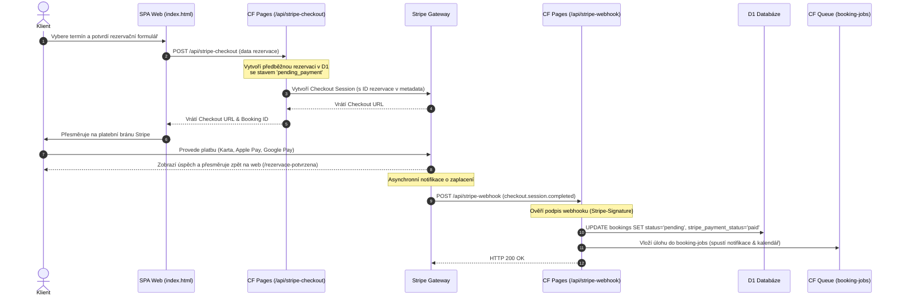

# Integrace platební brány Stripe — Návrh & Implementační plán

Tento dokument popisuje architekturu a postup integrace platební brány **Stripe** pro online zálohy a platby za biorezonanční terapie v ekosystému Bicom Písek.

---

## 1. Architektura toku plateb (Workflow)

Stripe bude integrován pomocí moderního a bezpečného toku **Stripe Checkout** (přesměrování na zabezpečenou platební stránku Stripe) v kombinaci s asynchronním webhookem pro zpracování výsledků plateb.



---

## 2. Změny v databázovém schématu D1

Pro evidenci plateb je nutné rozšířit tabulku `bookings` o platební atributy. Vytvoříme novou migraci `db/migrations/0007_stripe_integration.sql`:

```sql
-- db/migrations/0007_stripe_integration.sql

-- Rozšíření tabulky bookings o platební údaje
ALTER TABLE bookings ADD COLUMN stripe_session_id TEXT;
ALTER TABLE bookings ADD COLUMN stripe_payment_intent_id TEXT;
ALTER TABLE bookings ADD COLUMN stripe_payment_status TEXT; -- pending_payment | paid | failed | refunded
ALTER TABLE bookings ADD COLUMN paid_amount INTEGER; -- v haléřích/setinách koruny (Stripe používá minor units)
ALTER TABLE bookings ADD COLUMN paid_at TIMESTAMP;

-- Nová tabulka pro transakční logy (audit a bezpečnost)
CREATE TABLE IF NOT EXISTS payment_transactions (
    id TEXT PRIMARY KEY,
    booking_id TEXT NOT NULL,
    stripe_session_id TEXT NOT NULL UNIQUE,
    amount INTEGER NOT NULL,
    currency TEXT NOT NULL DEFAULT 'CZK',
    status TEXT NOT NULL,
    created_at TIMESTAMP DEFAULT CURRENT_TIMESTAMP,
    FOREIGN KEY(booking_id) REFERENCES bookings(id)
);

CREATE INDEX IF NOT EXISTS idx_bookings_stripe_session ON bookings(stripe_session_id);
```

---

## 3. Změny v Backend API (Cloudflare Pages Functions)

### A. Endpoint `functions/api/stripe-checkout.js` [NOVÝ]
Příjem dat z formuláře, vytvoření předběžné rezervace v D1 a iniciace Stripe Checkout Session.

```javascript
import Stripe from 'stripe';
import { DataCrypt } from '../lib/datacrypt.js';

export async function onRequestPost({ request, env }) {
  const stripe = new Stripe(env.SECRET_STRIPE_SECRET_KEY);
  const crypt = new DataCrypt(env.SECRET_ENCRYPTION_KEY);
  
  const data = await request.json();
  const bookingId = crypto.randomUUID();

  // 1. Zašifrování citlivých údajů
  const [nameEnc, emailEnc, phoneEnc] = await Promise.all([
    crypt.encrypt(data.name),
    crypt.encrypt(data.email),
    crypt.encrypt(data.phone),
  ]);

  // 2. Vytvoření Stripe Checkout Session
  const session = await stripe.checkout.sessions.create({
    payment_method_types: ['card'],
    line_items: [{
      price_data: {
        currency: 'czk',
        product_data: {
          name: `Biorezonance Bicom — ${data.serviceName}`,
          description: `Zálohová platba za rezervaci termínu: ${data.preferred_date}`,
        },
        unit_amount: 50000, // 500 Kč záloha (uvedeno v haléřích)
      },
      quantity: 1,
    }],
    mode: 'payment',
    success_url: `${new URL(request.url).origin}/rezervace-potvrzena?id=${bookingId}`,
    cancel_url: `${new URL(request.url).origin}/rezervace-zrusena?id=${bookingId}`,
    metadata: {
      bookingId: bookingId,
      serviceSlug: data.service,
    },
  });

  // 3. Uložení rezervace do D1 se stavem 'pending_payment'
  await env.DB.prepare(
    `INSERT INTO bookings (id, name_enc, email_enc, phone_enc, service, preferred_date, psc, estimated_price, status, stripe_session_id, stripe_payment_status)
     VALUES (?, ?, ?, ?, ?, ?, ?, ?, 'pending_payment', ?, 'pending_payment')`
  ).bind(
    bookingId, nameEnc, emailEnc, phoneEnc, data.service, 
    data.preferred_date, data.psc || null, data.estimated_price || null,
    session.id
  ).run();

  return new Response(JSON.stringify({ url: session.url, bookingId }), {
    headers: { 'Content-Type': 'application/json' }
  });
}
```

### B. Endpoint `functions/api/stripe-webhook.js` [NOVÝ]
Zpracování asynchronních zpráv od Stripe (ověření přes podpis webhooku).

```javascript
import Stripe from 'stripe';

export async function onRequestPost({ request, env }) {
  const stripe = new Stripe(env.SECRET_STRIPE_SECRET_KEY);
  const signature = request.headers.get('stripe-signature');
  const payload = await request.text();
  
  let event;
  try {
    event = stripe.webhooks.constructEvent(
      payload,
      signature,
      env.SECRET_STRIPE_WEBHOOK_SECRET
    );
  } catch (err) {
    return new Response(`Webhook Error: ${err.message}`, { status: 400 });
  }

  if (event.type === 'checkout.session.completed') {
    const session = event.data.object;
    const bookingId = session.metadata.bookingId;

    // 1. Aktualizace D1 (převod ze stavu pending_payment na pending)
    await env.DB.batch([
      env.DB.prepare(
        `UPDATE bookings 
         SET status = 'pending', stripe_payment_status = 'paid', 
             stripe_payment_intent_id = ?, paid_amount = ?, paid_at = CURRENT_TIMESTAMP
         WHERE id = ?`
      ).bind(session.payment_intent, session.amount_total, bookingId),
      
      env.DB.prepare(
        `INSERT INTO payment_transactions (id, booking_id, stripe_session_id, amount, status)
         VALUES (?, ?, ?, ?, 'completed')`
      ).bind(crypto.randomUUID(), bookingId, session.id, session.amount_total)
    ]);

    // 2. Načtení detailů pro queue
    const booking = await env.DB.prepare('SELECT * FROM bookings WHERE id = ?').bind(bookingId).first();

    // 3. Vložení do fronty booking-jobs pro odeslání e-mailu a zápis do kalendáře
    await env.BOOKING_QUEUE.send({
      bookingId: booking.id,
      name: booking.name_enc, // bude dešifrováno v consumeru
      email: booking.email_enc,
      phone: booking.phone_enc,
      service: booking.service,
      preferred_date: booking.preferred_date,
      estimated_price: booking.estimated_price,
      stripe_paid: true
    });
  }

  return new Response(JSON.stringify({ received: true }), { status: 200 });
}
```

---

## 4. Změny ve Frontend aplikaci (SPA)

- **Rezervační průvodce (`public/assets/js/guide.js`):**
  - Místo přímého volání `/api/book` a zobrazení úspěchu se zavolá `/api/stripe-checkout`.
  - Po obdržení URL se uživatel plynule přesměruje na Stripe Checkout.
- **Stránka úspěchu (`public/rezervace-potvrzena.html`):**
  - Nová statická stránka s děkovným textem, informacemi o platbě a pokyny k přípravě na terapii.
- **Stránka zrušení (`public/rezervace-zrusena.html`):**
  - Informace o nedokončené platbě s možností zkusit to znovu.

---

## 5. Nová vyžadovaná Secrets (Cloudflare)

Pro zprovoznění plateb bude nutné do Cloudflare Dashboardu přidat tyto tajné klíče:

1.  **`SECRET_STRIPE_SECRET_KEY`** (Stripe tajný klíč API, např. `sk_live_...`)
    - *Kam:* Pages (`bicom-pisek`) i Worker (`bicom-booking-consumer` — pokud by vracel refundace).
2.  **`SECRET_STRIPE_WEBHOOK_SECRET`** (Podpisový klíč webhooku Stripe, např. `whsec_...`)
    - *Kam:* Pouze Pages (`bicom-pisek`).
